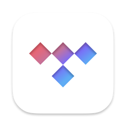
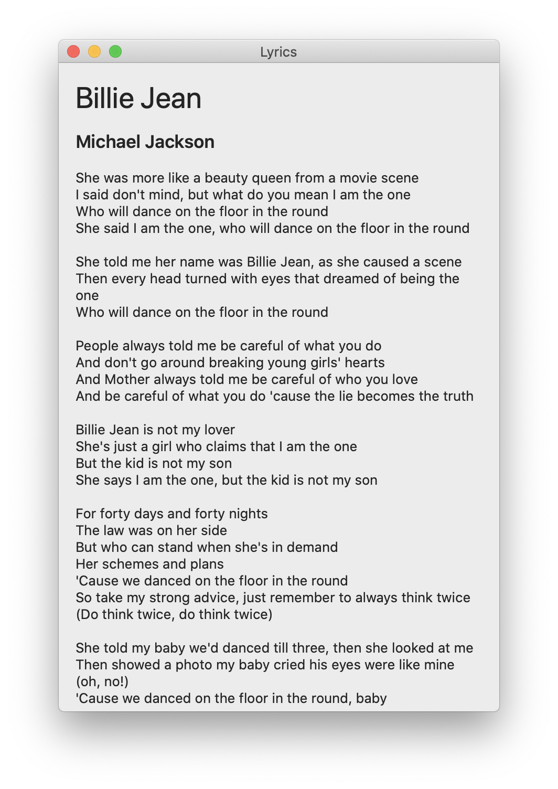
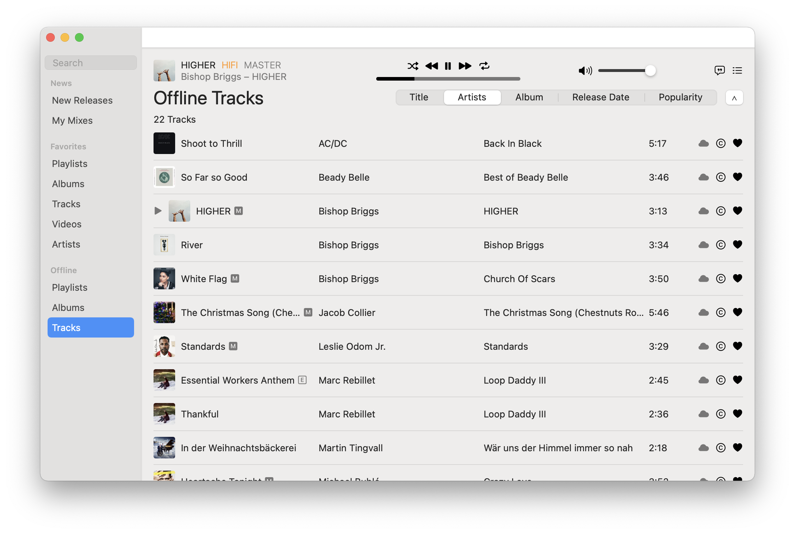
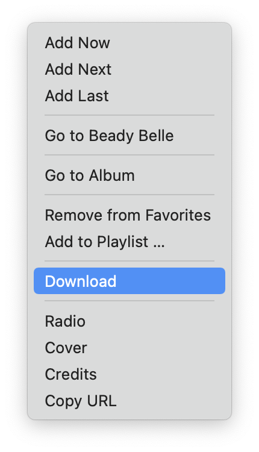
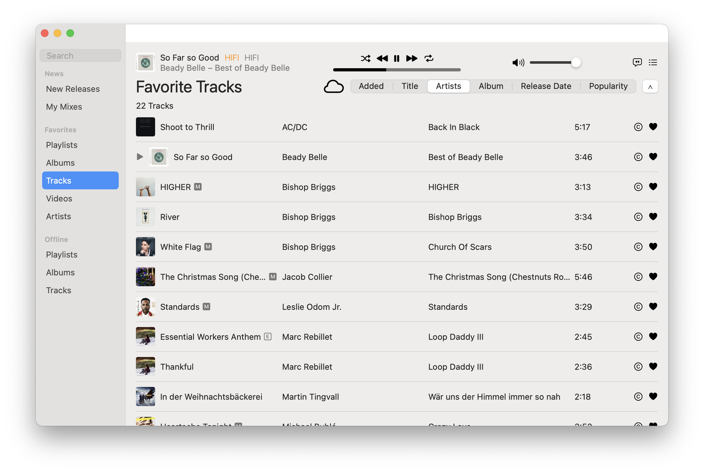
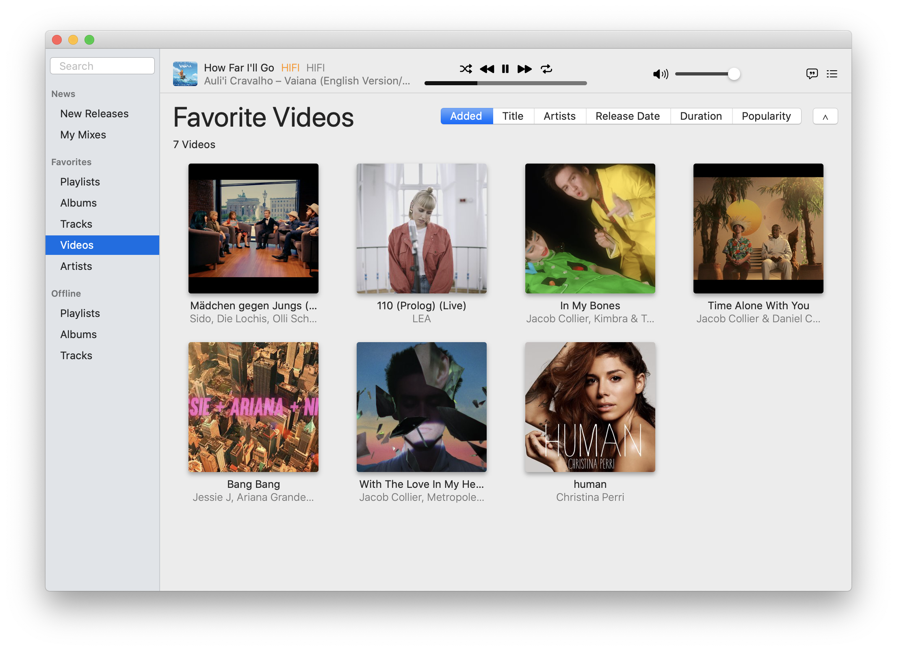
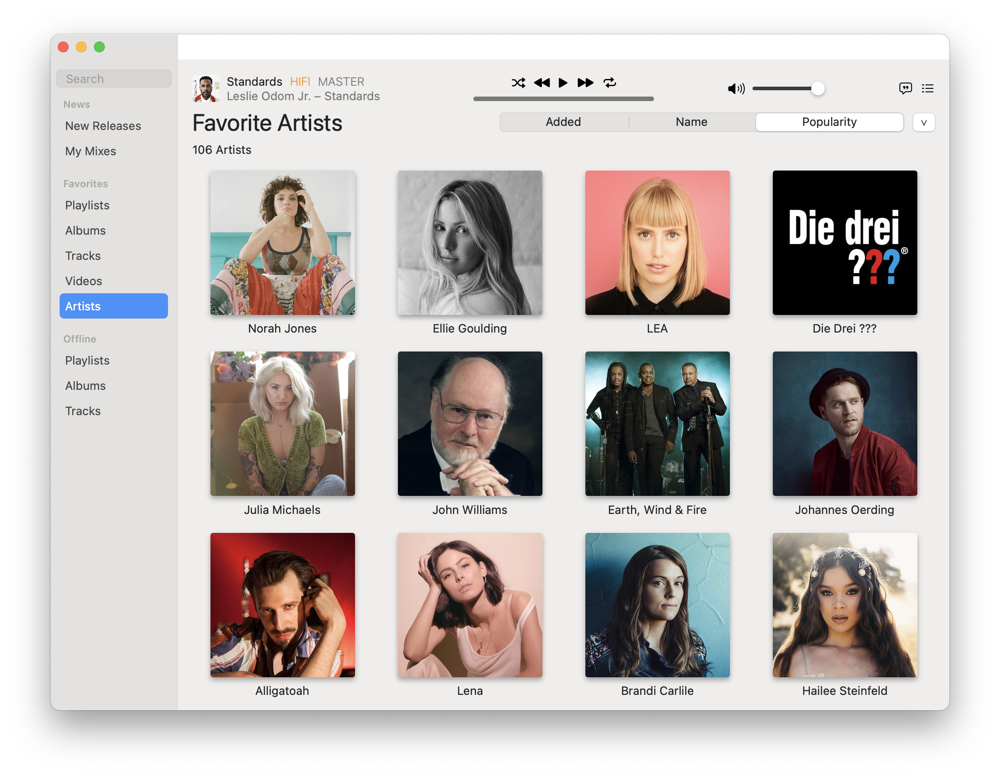
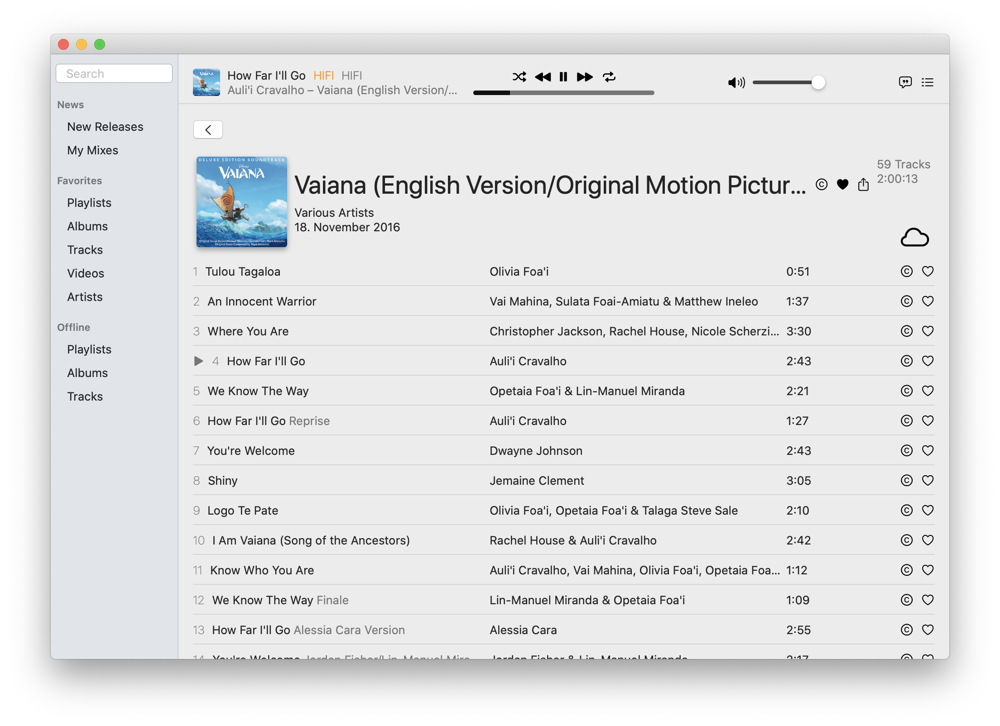

# TidalSwift

Tidal Music Streaming Client & Library written in Swift

It supports all major features of the official Tidal app, while adding additional ones, like New Releases, Lyrics, automatic Dark Mode, Downloads & Offline Playback – all while being only 1/10th the size of the official app.

> [!IMPORTANT]
>
> I have continued work on TidalSwift 🎉


## Download

You can download the latest version [here](https://github.com/melgu/TidalSwift/releases).
After downloading and unpacking the TidalSwift.zip, move the app to the Applications folder. Because the app is unsigned (I refuse to give current Apple money), you need to explicitly allow the app after the first start in the Privacy system settings. Alternatively, you can execute this:

```sh
xattr -d com.apple.quarantine /Applications/TidalSwift.app
```


## Impressions

### New Releases

Unlike the official Tidal app, TidalSwift can display new releases by your favorite artists.


### Lyrics

Also, unlike the official app, it can display the Lyrics of the currently playing song.



### Offline

This is a big one. The official desktop app still doesn't support offline playback – and probably never will. This app does!



### Downloads

It even goes a step further. You can download music to your hard drive and do with it whatever you want.



### My Mixes


### Search


### Favorites








### Detail Views




### Login


### Credits


### Dark Mode

TidalSwift obviously supports the macOS Dark Mode.


