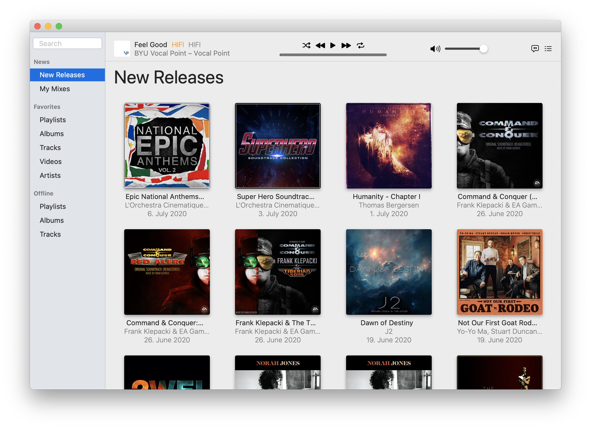
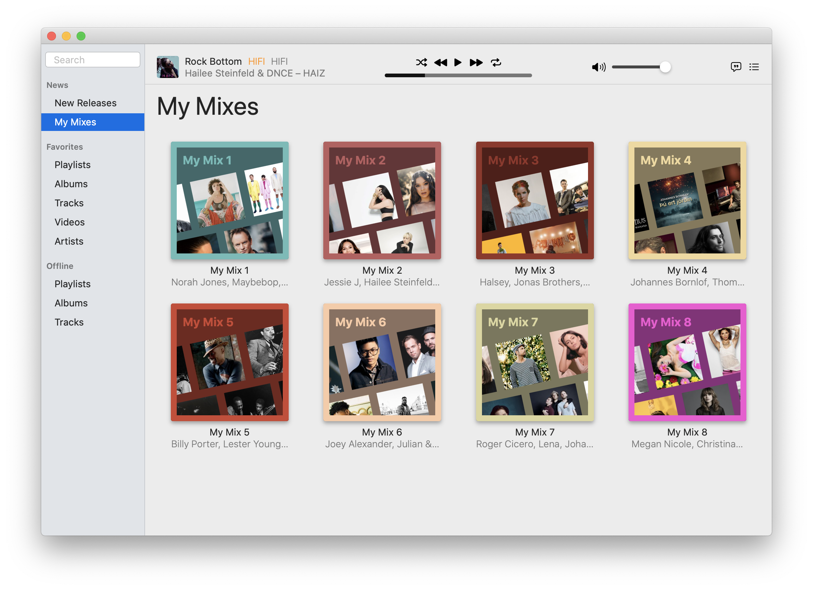
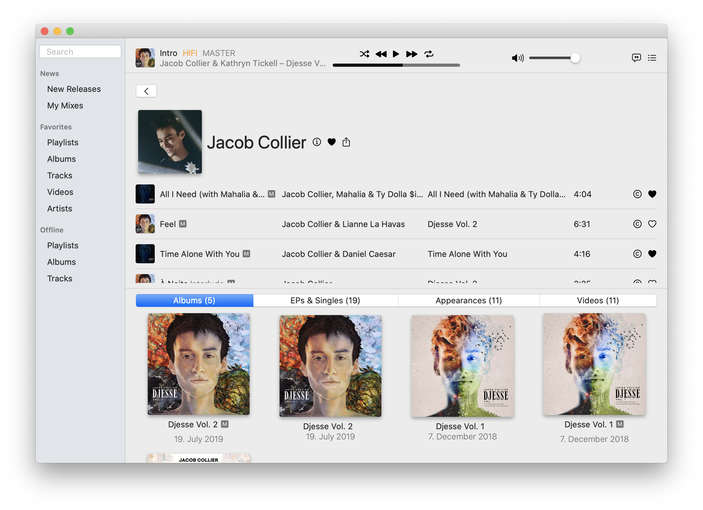

# TidalSwift

Tidal Music Streaming Client & Library written in Swift

It supports all major features of the official Tidal app, while adding additional ones, like New Releases, Lyrics, Dark Mode, Downloads & Offline Playback – all while being only 1/10th the size of the official app.

## Impressions

### New Releases

Unlike the official Tidal app, this app can display new releases by your favorite artists.

### Lyrics

Also, unlike the official app, TidalSwift can display the Lyrics of the currently playing song.

### My Mixes

### Search

### Favorites

### Detail Views

### Login

### Credits

### Dark Mode

TidalSwift obviously supports the macOS Dark Mode.

.png)

